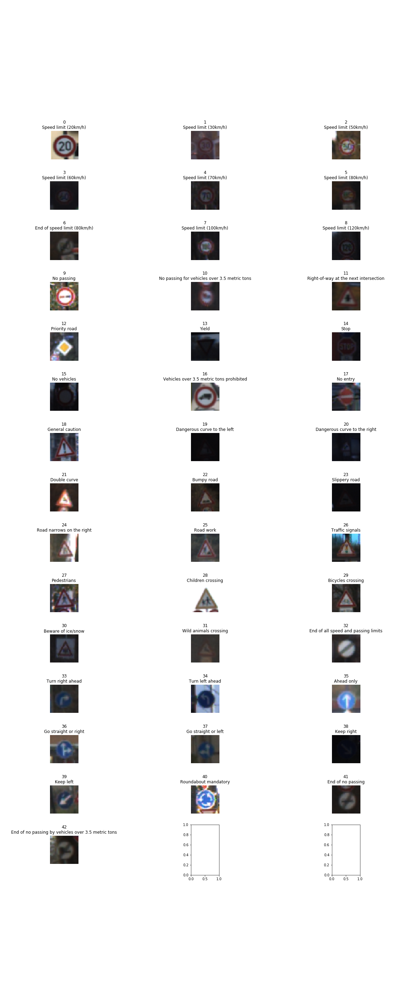
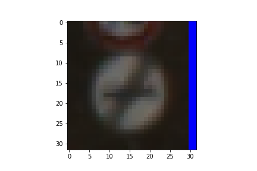
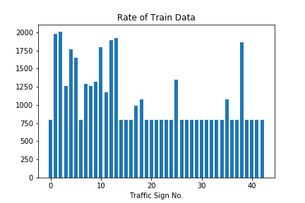
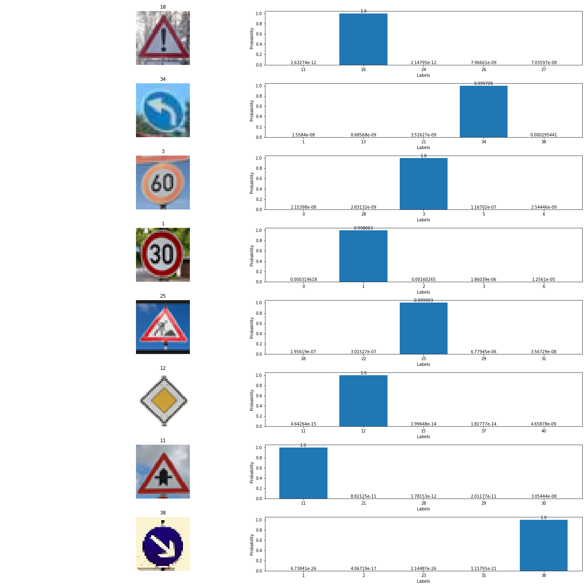

# **Traffic Sign Recognition** 

## Writeup

---

**Build a Traffic Sign Recognition Project**

The goals / steps of this project are the following:
* Load the data set (see below for links to the project data set)
* Explore, summarize and visualize the data set
* Design, train and test a model architecture
* Use the model to make predictions on new images
* Analyze the softmax probabilities of the new images
* Summarize the results with a written report

## Rubric Points
### Here I will consider the [rubric points](https://review.udacity.com/#!/rubrics/481/view) individually and describe how I addressed each point in my implementation.  

---
### Writeup / README

#### 1. Provide a Writeup / README that includes all the rubric points and how you addressed each one. You can submit your writeup as markdown or pdf. You can use this template as a guide for writing the report. The submission includes the project code.

You're reading it! and here is a link to my [project code](https://github.com/udacity/CarND-Traffic-Sign-Classifier-Project/blob/master/Traffic_Sign_Classifier.ipynb)

### Data Set Summary & Exploration

#### 1. Provide a basic summary of the data set. In the code, the analysis should be done using python, numpy and/or pandas methods rather than hardcoding results manually.

I used the pandas library to calculate summary statistics of the traffic
signs data set:

* The size of training set is ? ---> 34799
* The size of the validation set is ? ---> 4410
* The size of test set is ? ---> 12630
* The shape of a traffic sign image is ? ---> (32, 32, 3)
* The number of unique classes/labels in the data set is ? ---> 43

#### 2. Include an exploratory visualization of the dataset.

Here is an exploratory visualization of the data set. It is a bar chart showing how the data ...

### Design and Test a Model Architecture

#### 1. Describe how you preprocessed the image data. What techniques were chosen and why did you choose these techniques? Consider including images showing the output of each preprocessing technique. Pre-processing refers to techniques such as converting to grayscale, normalization, etc. (OPTIONAL: As described in the "Stand Out Suggestions" part of the rubric, if you generated additional data for training, describe why you decided to generate additional data, how you generated the data, and provide example images of the additional data. Then describe the characteristics of the augmented training set like number of images in the set, number of images for each class, etc.)

As a first step, I decided to convert the images to normalized grayscale because ...

Here is an example of a traffic sign image before and after grayscaling.

And I decided to generate additional data because the data set was uneven.

To add more data to the the data set, I used the following techniques because it makes the network be able to learn the universal characteristics that can cope with rotation and displacement.

(1)rotation

(2)parallel displacement

(3)brighness shift

Here is an example of an original image and an augmented image:

The difference between the original data set and the augmented data set is the following ... 

#### 2. Describe what your final model architecture looks like including model type, layers, layer sizes, connectivity, etc.) Consider including a diagram and/or table describing the final model.

My final model consisted of the following layers:

| Layer         		|     Description	        					| 
|:---------------------:|:---------------------------------------------:| 
| Input         		| 32x32x3 RGB image   							| 
| Convolution 5x5 (Conv1)    	| 1x1 stride, same padding, outputs 28x28x6 	|
| Leaky RELU					|												|
| Max pooling	      	| 2x2 stride,  outputs 14x14x6 				|
| Convolution 5x5 (Conv2)	    | 1x1 stride, same padding, outputs 10x10x16 	|
| Leaky RELU					|												|
| Max pooling	      	| 2x2 stride,  outputs 5x5x16 				|
| Convolution 1x1 (Conv3)	    | 1x1 stride, same padding, outputs 5x5x48 	|
| Leaky RELU					|												|
| Max pooling & Flatten	      	| 2x2 stride,  outputs 1200 				|
| Fully connected		| outputs 120        									|
| Leaky RELU					|												|
| Dropout					|												|
| Fully connected		| outputs 84        									|
| Leaky RELU					|												|
| Dropout					|												|
| Softmax				| outputs 43        									|
|						|												|
|						|												|
 

#### 3. Describe how you trained your model. The discussion can include the type of optimizer, the batch size, number of epochs and any hyperparameters such as learning rate.

To train the model, I used an ....

(1)Optimizer: Adam

(2)Batch size: 128

(3)Number of epochs: 100

(4)Lerning Rate: 0.001

(5)Rate of Dropout: 0.5

(6)Loss: Cross Entropy + L2 Regularization

#### 4. Describe the approach taken for finding a solution and getting the validation set accuracy to be at least 0.93. Include in the discussion the results on the training, validation and test sets and where in the code these were calculated. Your approach may have been an iterative process, in which case, outline the steps you took to get to the final solution and why you chose those steps. Perhaps your solution involved an already well known implementation or architecture. In this case, discuss why you think the architecture is suitable for the current problem.

My final model results were:
* training set accuracy of ? ---> 0.984
* validation set accuracy of ? ---> 0.960
* test set accuracy of ? ---> 0.943

* What was the first architecture that was tried and why was it chosen? 

---> I chosed LeNet. Because it was recommended as a base model. (Now, I just knew there were aonother choise...)

* What were some problems with the initial architecture? 

---> Accuracy was not over 0.93. 

* How was the architecture adjusted and why was it adjusted? Typical adjustments could include choosing a different model architecture, adding or taking away layers (pooling, dropout, convolution, etc), using an activation function or changing the activation function. One common justification for adjusting an architecture would be due to overfitting or underfitting. A high accuracy on the training set but low accuracy on the validation set indicates over fitting; a low accuracy on both sets indicates under fitting.

---> To train better model, I implemented "1x1 convolution", "Drop out", "Leaky ReLU" and "L2 regularization".
(1) 1x1 convolution was implemented for model to learn more better feature.
(2) Leaky Relu was implemented for model to progress training.
(3) Dropout and L2 regularization were implemented to adjust overfitting.

* Which parameters were tuned? How were they adjusted and why?

---> I tuned "Epochs" for getting better model. I thought there was still room for growth. So I tried more iteration of training(optimise params). I think It was trade-off between epochs and learning rate.

* What are some of the important design choices and why were they chosen? For example, why might a convolution layer work well with this problem? How might a dropout layer help with creating a successful model?

---> First convolution layer has 5x5 kernel. this size might be proper to extract some features like edges, brightness. And 1x1 convolution layer might help the model to extract more features. Dropout might adjust overfitting.

To improve the model, I will put 1x1 convolution layer as first layer. It might help extracting more features.
And I will turn kernel' size of second convolution layer. I setted 5x5 kernel in all convolution layer. It might help extracting more features too.

* Confusion matrix and Consideration

---> Confusion matrix of test dataset is shown below. 

3 (Speed limit (50km/h)) was classified as 5 (Speed limit (80km/h)): 28 times

27 (Pedestrians) was classified as 29 (Bycycles crossing): 24 times

41 (End of no passing) was classified as 9 (No passing): 19 times

17 (No entry) was classified as 40 (Roundabout mandatory): 18 times(why? I don't think these looks like each other...)

These traffic sign looks like each other. So it might be so difficult to classify these traffic sign. To classify these correctly, we need images which have more high resolution.

### Test a Model on New Images

#### 1. Choose five German traffic signs found on the web and provide them in the report. For each image, discuss what quality or qualities might be difficult to classify.

Here are five German traffic signs that I found on the web:

The images of "Road Work" and "Right-of-way at the next intersection" might be difficult to classify because these looked like each other.

#### 2. Discuss the model's predictions on these new traffic signs and compare the results to predicting on the test set. At a minimum, discuss what the predictions were, the accuracy on these new predictions, and compare the accuracy to the accuracy on the test set (OPTIONAL: Discuss the results in more detail as described in the "Stand Out Suggestions" part of the rubric).

Here are the results of the prediction:

| Image			        |     Prediction	        					| 
|:---------------------:|:---------------------------------------------:| 
| 18 (General Caution)      		| 18 (General Caution)   									| 
| 34 (Turn left ahead)     			| 34 (Turn left ahead) 										|
| 3 (Speed limit (60km/h))					| 3 (Speed limit (60km/h))										|
| 1 (Speed limit (30km/h))	      		| 1 (Speed limit (30km/h))					 				|
| 25 (Road Work)			| 25 (Road Work)							|
| 12 (Priority road)			| 12 (Priority road)							|
| 11 (Right-of-way at the next intersection)			|  11 (Right-of-way at the next intersection)							|
| 38 (Keep right)			| 38 (Keep right)      							|

The model was able to correctly guess 5 of the 5 traffic signs, which gives an accuracy of 100%. This compares favorably to the accuracy on the test set of ...

#### 3. Describe how certain the model is when predicting on each of the five new images by looking at the softmax probabilities for each prediction. Provide the top 5 softmax probabilities for each image along with the sign type of each probability. (OPTIONAL: as described in the "Stand Out Suggestions" part of the rubric, visualizations can also be provided such as bar charts)

The code for making predictions on my final model is located in the 28th cell of the Ipython notebook.

Result is shown following image.

### (Optional) Visualizing the Neural Network (See Step 4 of the Ipython notebook for more details)
#### 1. Discuss the visual output of your trained network's feature maps. What characteristics did the neural network use to make classifications?

The code is located in the 30th cell of the Ipython notebook. We can find feature map which react edges.

